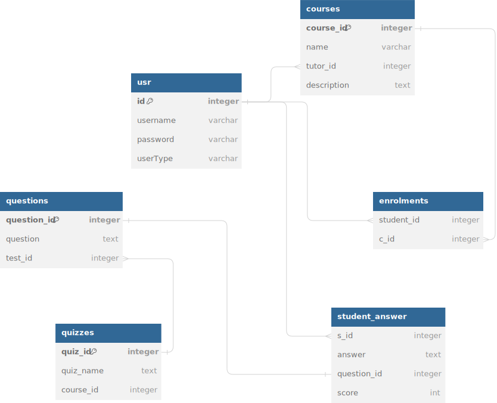

### INTRODUCTION
This project is a Java Swing application that have some functionalities to store data like an online course platform.
This is an assignment for the course of Intermediate Java 102 course.
It has a login page, a registration page, a course page, a course detail page, a course registration page, a course registration detail page, a course registration list.
It has a PostgreSQL database to store the data.

#### SOFTWARE REQUIREMENTS
Three different user roles are defined in the application: Admin, Instructor, and Student. 
Instructors:
- Can only see the courses assigned to them by the admin.
- Can not delete the courses.
- Can add,delete and edit content to their courses.
Course contents have the following fields:
- Title
- Description
- Video link
- Quizzes
Students:
- Can create an account and sign in.
- Can see all the courses.
- Can register for the courses.
- Can see the course contents they registered for.
- Can solve the quizzes.

Admin:
- Adds/deletes courses and add instructors.
- To add a course, the admin needs to add the corresponding instructor before.
Instructor:

####  ER DIAGRAM OF THE DATABASE
The following schema depicts the schema designed for this project.


The database is created using the bash script.
```bash
./create_database_psql
```


